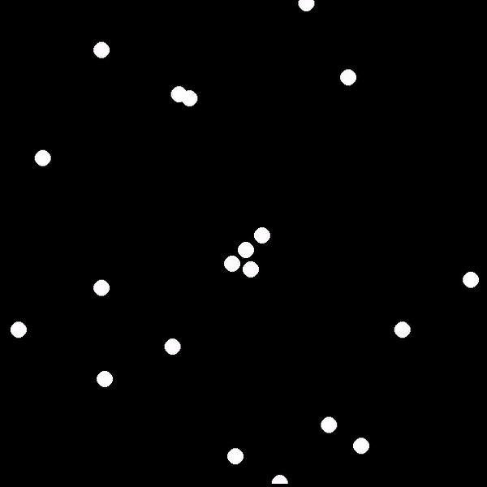
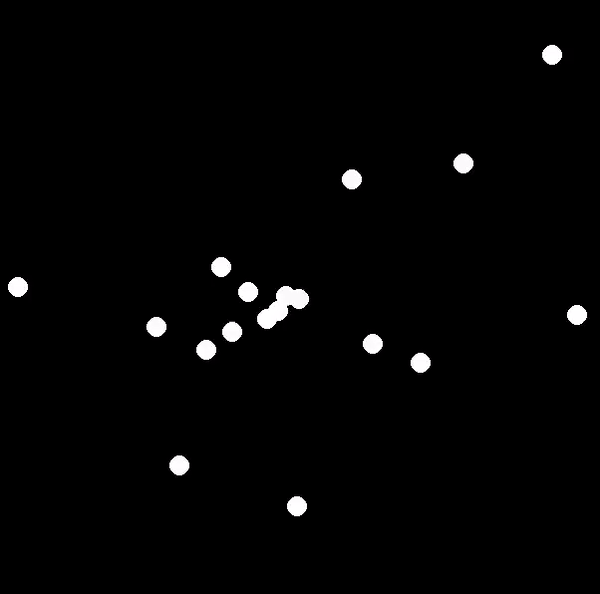
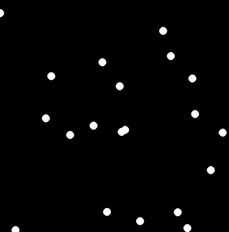
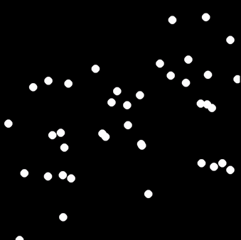
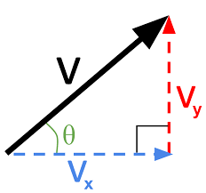
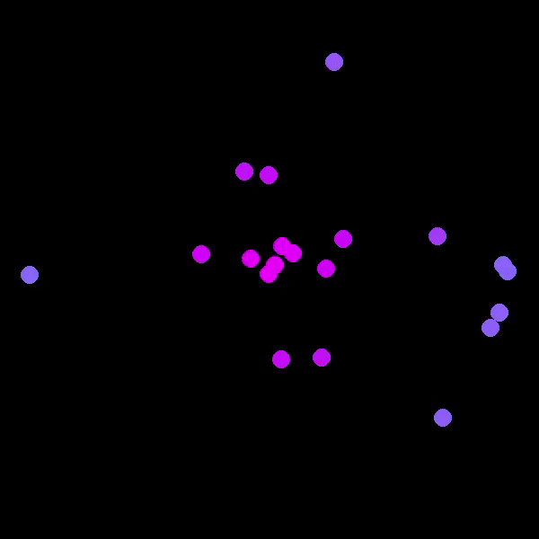

# Opdracht 7: Particle Storm
In deze opdracht maken jullie een Particle Storm. Dit is een simulatie die een aantal bewegende partikels (cirkels) op een scherm toont. Onderstaande is een voorbeeld van hoe de Particle Storm er op het einde uit kan zien.

<p align="center">
  
</p>

Jullie zullen dit niet in een keer ontwikkelen. Bij het ontwikkelen van (grotere) applicaties is het namelijk best om klein te beginnen. Vervolgens kan je de applicatie steeds verder uitbreiden. Jullie zullen starten met een basisimplementatie (versie 1). Na deze basis, zullen jullie de Particle Storm verder verbeteren en uitbreiden. Voor iedere versie zijn er instructies voorzien in deze README. Opgelet, de README vertelt je wat te doen, niet hoe. Experimenteren is dus noodzakelijk. Er zijn in totaal 8 versies. Probeer zo ver mogelijk te raken!

### Tip
Iedere versie bouwt verder op de vorige. Je zal constant code moeten wijzigen. Het is dan ook een goed idee om een kopie te maken van de laatste stabiele versie. Zo kan je altijd teruggaan, mocht dit nodig zijn.

## Basis implementatie (versie 1)
Je hebt 2 bestanden gekregen om mee te starten.
* `particle.py`: bevat de klasse **BoringParticle**, waarmee alle partikel-objecten gemaakt zullen worden. Dit bestand is momenteel nog nagenoeg leeg. Je zal zelf moeten bepalen welke eigenschappen/methoden noodzakelijk zijn.
* `particle_storm.py`: bevat de pygame applicatie. Dit bestand is compleet, behalve op 2 plekken (zie *TODO*). Je zal de code aanvullen op basis van de zelfgemaakte klasse **BoringParticle** in `particle.py`.

Op het einde van deze versie moet `particle_storm.py` uitvoeren, dit resultaat geven. Je hebt een aantal partikels die met een **vaste snelheid** een **willekeurige richting** uitgaan. Eenmaal de rand bereikt is, reset het partikel terug naar het midden. Het zal nu een nieuwe willekeurige richting uitgaan.
<p align="center">
  
</p>

Allereerst moet je bepalen wat de eigenschappen/methoden van **BoringParticle** worden. Maak hiervoor gebruik van bovenstaande uitleg, de *TODO* in `particle_storm.py` en het stappenplan uit oefen mee 8. Alvast een kleine hint: ieder partikel moet getekend worden op een 2D-vlak, en iedere loop moet deze positie een beetje wijzigen.

### Tip
Het is eenvoudiger om de positie van een partikel tussen 0 en 1 te laten varieren. 
- 0 is hierbij de linker- & bovengrens. 
- 1 is de rechter- & ondergrens.

Hierna kan je in `particle_storm.py` het partikel op het scherm tekenen. Dit door de positie van het partikel te vermenigvuldigen met de breedte en hoogte van het scherm. Deze manier heeft als voordeel dat de klasse **BoringParticle** zal blijven werken, ook als je de grootte van het scherm wijzigt. Onderstaande tekening toont voor een aantal situaties de positie van het partikel & hoe dit zich vertaalt naar het scherm.
<p align="center">
  
</p>

## Versie 2
In versie 1 bewegen alle partikels even snel. Dit is vrij saai. Leuker is als deze, net als de richting, willekeurig is. Laat de snelheid van een partikel varieren tussen 0 en de meegegeven snelheid/snelheden. Na het resetten van een partikel, moet deze een nieuwe willekeurige snelheid krijgen.
<p align="center">
  
</p>


## Versie 3
Versie 2 heeft mogelijks een ernstig gebrek. Ga naar `particle_storm.py` en wijzig de variabele **FPS** naar 10. Zijn de partikels trager? Dan is je simulatie FPS-afhankelijk. Als dit niet het geval is, mag je verdergaan naar versie 4.
<p align="center">
  
</p>

De partikels bewegen met behulp van een methode. Deze methode wordt opgeroepen in de while-loop van `particle_storm.py`. Doormiddel van de klok weten we dat de while-loop (en dus ook de methode) *FPS* keer wordt uitgevoerd iedere seconde. Omdat *FPS* gedaald is van 120 naar 10, bewegen de partikels dus exact 12x trager.
```math
Hoever is partikel bewogen na 1 seconde?
afstand = snelheid * fps 
```

De partikels moeten na 1 seconde evenver bewegen, onafhankelijk van de fps. Dit kan door afstand in bovenstaande formule te vermenigvuldigen met *1/FPS*. *1/FPS* is de tijd tussen twee frames. De variabele *interval* in `particle_storm.py` geeft deze tijd.
```math
Hoever is partikel bewogen na 1 seconde?
afstand = snelheid * fps * 1/fps
        = snelheid * fps * interval
        = snelheid !Partikels bewegen een afstand gelijk aan de snelheid, onafhankelijk van fps!
```

Op het einde van deze versie moet de simulatie fps-onafhankelijk zijn. Links toont de simulatie bij 10 fps, rechts bij 120 fps. Ze bewegen even snel! Merk wel op dat de simulatie er bij 10 fps veel hakkeriger uitziet.
<p align="center">
  
  
</p>

## Versie 4
De huidige partikels zijn saai. Daarom dat ze ook uit de klasse **BoringParticle** komen. Het zou leuk zijn als partikels verschillende bewegingspatronen hebben. Bijvoorbeeld botsen tegen de rand, meedraaiend met de klok, gravitationele aantrekking tot het midden, ... .

Maak een nieuwe klasse **BouncingParticle**  aan in `particle.py`. Importeer deze ook in `particle_storm.py` & voeg ze toe aan de lijst *particles*. Deze klasse is bijna identiek aan **BoringParticle**. Er is echter een belangrijk verschil.
```
Partikels van BouncingParticle zullen tegen de rand botsen, niet resetten. Na een botsing zal hun beweging wijzigen. Dit afhankelijk van de rand waarmee ze botsen.
```

### Tip
Om de beweging te berekenen is het in dit geval het eenvoudigst om de snelheid op te splitsen in een horizontale (x) snelheid & verticale (y) snelheid. Afhankelijk van de rand waarmee de bal botst, zal dit deze snelheden als volgt beinvloeden.
```math
Bal botst met linker- of rechter-rand:
  v_x = -v_x (snelheid in de x-richting wordt het tegengestelde)
  v_y = v_y  (snelheid in de y-richting blijft hetzelfde)

Bal botst met boven- of onder-rand:
  v_x = v_x  (snelheid in de x-richting blijft hetzelfde)
  v_y = -v_y (snelheid in de y-richting wordt het tegengestelde)
```

Het resultaat ziet er als volgt uit. Links zijn er alleen **BouncingParticle**, rechts zijn er zowel **BoringParticle** als **BouncingParticle**
<p align="center">
  
  
</p>


## Versie 5
Tot nog toe hebben **BoringParticle** en **BouncingParticle** dezelfde kleur. Dit maakt het moeilijk om ze uit elkaar te houden. Voeg een nieuwe eigenschap *kleur* toe aan beide klassen.
- **BoringParticle**: deze moet altijd wit zijn, dus een waarde van (255,255,255).
- **SpinningParticle**: zijn afwisselen geel (255,0,255) en blauw (0,0,255). Ze wisselen van kleur nadat ze botsen met een rand.
<p align="center">
  
</p>

In `particle_storm.py` worden alle partikels wit gekleurd (in *pygame.draw.circle*). Je zal deze vaste waarde dus moeten vervangen door de eigenschap *kleur*.


## Versie 6
Maak een nieuwe klasse **SpinningParticle** aan in `particle.py`. importeer deze ook in `particle_storm.py` & voeg ze toe aan de lijst *particles*. Deze klasse is bijna identiek aan **BoringParticle**. Er is echter een belangrijk verschil.
```
Partikels van SpinningParticle zullen met de klok meedraaien terwijl ze bewegen.
```

De kleur moet veranderen, naargelang ze bewegen. Bijvoorbeeld rood (255,0,0) als het partikel puur horizontaal beweegt & blauw (0,0,255) wanneer verticaal. Indien de beweging zowel horizontaal als verticaal is, moet de kleur een mengeling tussen rood & blauw zijn.

Het resultaat ziet er als volgt uit. Alle andere partikels zijn in het voorbeeld links weggelaten. Het voorbeeld rechts toont de 3 soorten partikels samen.
<p align="center">
  
  
</p>

### Tip
De richting wijzigen kan heel moeilijk of heel makkelijk zijn. Dit afhankelijk van hoe je de beweging berekent. Gebruik je hiervoor een snelheid in de x- en y-richting? Dan kan je best naar een andere methode overgaan.

Bekijk onderstaande figuur. Jullie gebruiken momenteel de rode en blauwe pijl om de snelheid te bepalen. Er is echter ook een andere manier. Combineer de zwarte pijl en de groene hoek.
<p align="center">
  
</p>

Je kan dan de snelheid in de x- en y-richting nu bepalen met goniometrie. Deze hoek moet een willekeurig getal zijn tussen 0 en 2*π. Door theta iedere loop lichtjes te verhogen, zal het partikel beginnen draaien.
```math
v_x = v*cos(θ)
v_y = v*sin(θ)
```

## Versie 7
in sommige gevallen bewegen partikels zeer traag, waardoor het lange tijd duurt vooraleer ze verdwijnen, of iets doen. Probeer dit op volgende manieren op te lossen.
- Leg de minimumsnelheid hoger. Bijvoorbeeld zodat het partikel minstens 20% van de meegegeven snelheid moet gaan.
- Ieder frame een random kans in te stellen dat het partikel reset, ongeacht of ze bij de rand zijn of niet. Deze kans moet groter worden naarmate de *FPS* daalt.

## Versie 8
Voeg een klasse **GravitationalParticle** toe aan `particle.py`. Importeer deze ook in `particle_storm.py` & voeg ze toe aan de lijst *particles*. Deze partikels zijn aangetrokken tot het midden van het scherm. Je zal hiervoor een soort zwaartekracht moeten implementeren. De kleur moet veranderen afhankelijk van hoever deze van het midden is. Paars (255,0,255) is perfect in het midden, cyaan (0,255,255) is de uiterste rand. Iedere afstand hiertussen moet een mengeling tussen paars & cyaan zijn.
<p align="center">
  
  
</p>